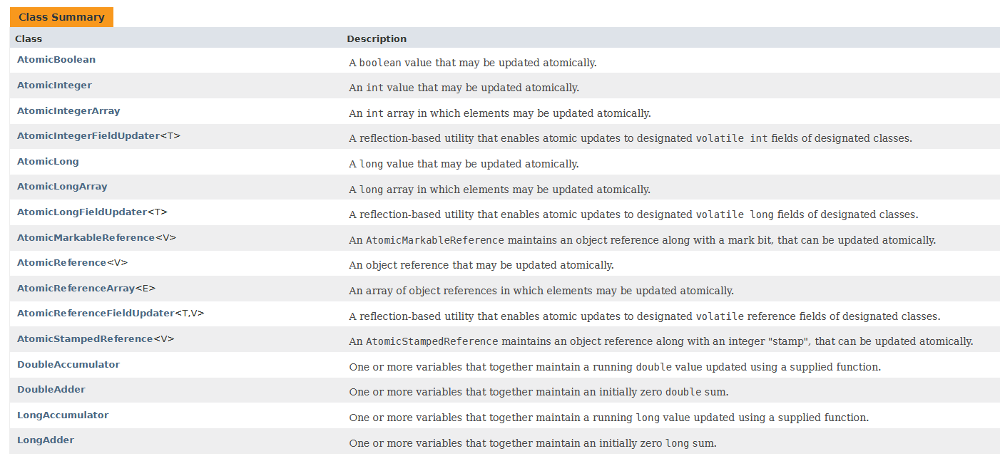

- [1 CAS(Compare And Swap) 概念和原理](#1-cascompare-and-swap-概念和原理)
- [2 Java中的CAS](#2-java中的cas)
- [3 Java中依赖Unsafe的CAS实现的一些原子操作类](#3-java中依赖unsafe的cas实现的一些原子操作类)
- [4 CAS的三大问题](#4-cas的三大问题)
  - [4.1 ABA问题](#41-aba问题)
  - [4.2 循环导致CPU消耗过多](#42-循环导致cpu消耗过多)
  - [4.3 只能保证一个共享变量的原子操作](#43-只能保证一个共享变量的原子操作)
- [5 参考资料](#5-参考资料)

# 1 CAS(Compare And Swap) 概念和原理

CAS是Compare And Swap的缩写，中文含义是比较和交换。CAS定义了三个值：

* V : 待更新的变量Var
* E : 预期的旧值Expected Value
* N : 新值New

执行过程的伪代码如下：

```java
if(V==E){
  V=N;
}
```

也就是说只有在变量V的值等于期望的旧值时，才更新V为新值N。不然什么都不做。以此证明其他线程没有更改V的值。**根据上面的伪代码来看，是不是会出现if通过了，但是在V=N的时候其他线程改了V呢？其实不会的，CAS的底层实现是依赖CPU的原子指令(cmpxchgl和lock)来实现的，也就是说比较和赋值操作是一个CPU级别的原子操作！ 那么在多线程操作同一个变量时，只会有一个线程操作成功，其他的都会失败 ，但是并不会阻塞其他线程，其他线程可以利用循环进行重试或者放弃修改。这是实现乐观锁的基础。**


# 2 Java中的CAS

Java中提供了Unsafe类来提供CAS操作，目前有如下三个方法。

```java
public final native boolean compareAndSwapObject(Object o, long offset,Object expected, Object x);
public final native boolean compareAndSwapInt(Object o, long offset,int expected,int x);
public final native boolean compareAndSwapLong(Object o, long offset,long expected,long x);
```

参数和返回值解释：
1. 参数`o` : 字段变量所属的对象。
2. 参数`offset` : 变量相对于`o`在内存中的偏移位置。这个值是和class相关的，和具体对象无关。
3. 参数`expected` : 期望的旧值。
4. 参数`x` : 新值。当前面两个参数定位到的变量的值等于`expected`代表的旧值是，才更新。
5. 返回值`boolean` : 更新成功返回`true`, 否则就是`false`。

这三个方法不会阻塞线程，然后调用方可以根据返回值决定是否重试或者放弃修改。


# 3 Java中依赖Unsafe的CAS实现的一些原子操作类

一个示例[CASExample.java](CASExample.java)。

Java中依赖Unsafe的CAS实现的一些原子操作类位于[java.util.concurrent.atomic](https://docs.oracle.com/javase/8/docs/api/java/util/concurrent/atomic/package-summary.html)包下。



# 4 CAS的三大问题

## 4.1 ABA问题

ABA指的是V的值原来是A，变成了B，后来又更新为了A。这时JDK1.5引入了一个[AtomicStampedReference](https://docs.oracle.com/javase/8/docs/api/java/util/concurrent/atomic/AtomicStampedReference.html)
来解决ABA的问题。原理是增加一个`Pair<T>`类型来持有引用和一个附加的标记`stamp`充当版本号。
```java
private static class Pair<T> {
    final T reference;
    final int stamp;
    private Pair(T reference, int stamp) {
        this.reference = reference;
        this.stamp = stamp;
    }
    static <T> Pair<T> of(T reference, int stamp) {
        return new Pair<T>(reference, stamp);
    }
}
```
在执行cas时，**同时检查这两个字段: 调用时newStamp为expectedStamp+1作为版本号,由于是每次都+1，所以每次更改Pair的reference都会增加stamp，就可以避免ABA的问题了**。
```java
public boolean compareAndSet(V   expectedReference,
                              V   newReference,
                              int expectedStamp,
                              int newStamp) {
    Pair<V> current = pair;
    return
        expectedReference == current.reference &&
        expectedStamp == current.stamp &&
        ((newReference == current.reference &&
          newStamp == current.stamp) ||
          casPair(current, Pair.of(newReference, newStamp)));
}
```

当然有时候我们并不关心是不是ABA，而是关心V是否被改动了，即使是先变成了B后又变成了A，也是可以的。所以这时候可以使用[AtomicMarkableReference<T>](https://docs.oracle.com/javase/8/docs/api/java/util/concurrent/atomic/AtomicMarkableReference.html)。它和AtomicStampedReference的差异在于Pair的字段不是int，而是boolean了，修改了就是true。


## 4.2 循环导致CPU消耗过多

自旋锁通常采用CAS，如果自旋时间过长仍然不成功，会占用大量的CPU资源。

解决办法时让JVM支持处理器提供的`pause`指令 : 失败时睡眠一会接着重试。

## 4.3 只能保证一个共享变量的原子操作

两种解决方案：
1. 使用JDK 1.5提供的`AtomicReference`类保证对象之间的原子性，把多个变量放到一个对象里面进行CAS操作；
2. 使用锁。锁内的临界区代码可以保证只有当前线程能操作。


# 5 参考资料

1. 深入浅出Java多线程-CAS与原子操作: <http://concurrent.redspider.group/article/02/10.html>
2. java.util.concurrent.atomic : <https://docs.oracle.com/javase/8/docs/api/java/util/concurrent/atomic/package-summary.html>

